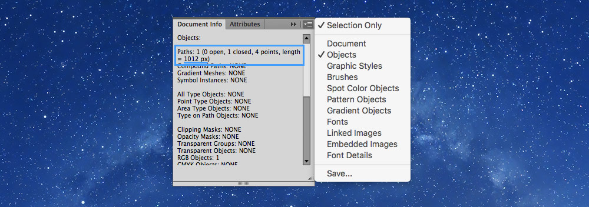

# SVG line drawing

## Overview

- *Fork this repository.*
- Export the SVG graphic from the `narwhal.ai` file—it’s already perfectly set up with layer & artboard names.
- Insert the SVG into an embed container, adding `.img-flex` onto the SVG.
  It’s better if the SVG isn’t `.embed-item` itself, but inside a `<div>` that is the `.embed-item`
- Add line drawing animations to the rainbow colours and the narwhal’s body.
- Add fade-in animations to the heading and the narwhal’s eye.
- The `index.html` file is already started and all the CSS files are already hooked up.
- *Run it through Markbot and make sure it passes all the checks.*

---

## Details

- *Typefaces:* `Unica One` (already included in the HTML)
- *Expected class names:* `.embed`, `.embed-16by9`, `.embed-item`
- *Expected IDs:* `#narwhal-body`, `#narwhal-eye`, `#rainbow-violet`, `#rainbow-indigo`, `#rainbow-blue`, `#rainbow-green`, `#rainbow-yellow`, `#rainbow-orange`, `#rainbow-red` (all defined as layers in the Illustartor document)
- *Gridifier settings:* included
- *Typografier settings:* included
- *Modulifier settings:* included

### How line drawing animation works

Line drawing animation works by manipulating the stroke’s dashed line settings. Imagine a stroke in Illustrator that is a dashed line; now imagine the space between the dashes is the length of the stroke itself—it will appear that there is no stroke at all.

With `animation` we slowing reduce the `dashoffset` down to `0` causing the line to draw back into place.

There are two important properties:

- `stroke-dasharray` — This needs to be set to the length of the stroke itself.
- `stroke-dashoffset` — This also needs to be set to the length of the stroke initially, but then is animated to a length of `0` using `@keyframes`

You’ll end up with CSS that looks like this:

```css
.unicorn-horn {
  animation: …;
  stroke-dasharray: …px; /* The length of the stroke */
  stroke-dashoffset: …px; /* The length of the stroke */
}

/* Plus a @keyframes set that animates `stroke-dashoffset` back to `0` */
```

#### Finding the length of a stroke

Illustrator will give you the length of the stroke in pixels, to use in both `stroke-dasharray` & `stroke-dashoffset`, under the `Document Info` palette.



1. Go to `Window > Document Info`
2. In the “extra settings” menu of the palette, enable `Objects`
3. Select the element and it’s path information will show in the `Document Info` palette

#### Helpful links

- [SVG Line Animation for the Uninitiated](https://medium.com/bitmatica-lab/svg-line-animation-for-the-uninitiated-5a65d91c6044)
- [Three Illustrator tricks for better SVG stroke animations](http://valhead.com/2017/03/03/three-illustrator-tricks-for-better-svg-stroke-animations/)

---

## Goal

Visually match the images in the “screenshots” folder and create the interaction shown in the linked video.

- Final screenshots in the “screenshots” folder.
- [**Watch this video to see how it interacts.**](https://youtu.be/s4JC50oFfgA)
  *This video shows the browser being refreshed a few times—the components only need to animate in once.*

---

## Hand in

Drop this folder into your Markbot application. Make sure to fix all the errors. And submit to Canvas using Markbot.
